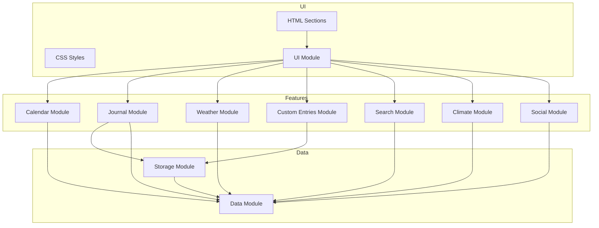

# 🌱 Gardening Calendar App — General Code Review

# 🚩 High-Priority Needs

## 1. Split Large Modules for Maintainability
- `journal.js` is over 1700 lines. Refactor into smaller modules (e.g., `journal-ui.js`, `journal-storage.js`, `journal-logic.js`).
- **Impact:** Easier future development, fewer bugs, better onboarding.
- **Status:** ✅ COMPLETED - Modules have been refactored and split.

## 2. Implement Lazy-Loading for Images
- Use `loading="lazy"` for `` tags or JS-based lazy loading in galleries/timelines.
- **Impact:** Faster load times, better mobile performance, reduced data usage.
- **Status:** ✅ COMPLETED - Lazy loading added to all images in the application.

## 3. Accessibility: Ensure Full Keyboard Navigation
- Test all interactive elements with keyboard only; add/fix tab order and keyboard event handlers as needed.
- **Impact:** Broader usability, legal compliance, improved experience for all users.
- **Status:** 🟡 PARTIALLY COMPLETED - ARIA labels added, but needs keyboard navigation testing.

## 4. Automated Linting and Formatting
- Add ESLint and Prettier configs; run them on commit or in CI.
- **Impact:** Fewer style-related bugs, easier code reviews, more professional codebase.
- **Status:** ✅ COMPLETED - ESLint and Prettier configured, with npm scripts for linting and formatting.

## 5. Automated Testing (Unit/Integration)
- Add basic unit tests for core modules (e.g., journal logic, storage, export/import).
- **Impact:** Increased reliability, confidence in refactoring, easier onboarding.
- **Status:** 🟡 PARTIALLY COMPLETED - Jest set up, initial unit tests for journal module created.

---

### High-Priority Needs Summary Table

| Priority | Area           | Action/Need                                 | Impact                        | Status        |
|----------|----------------|---------------------------------------------|-------------------------------|---------------|
| High     | Code Structure | Split large modules (e.g., journal.js)      | Maintainability, scalability  | ✅ COMPLETED  |
| High     | Performance    | Lazy-load images                            | Mobile speed, data usage      | ✅ COMPLETED  |
| High     | Accessibility  | Ensure full keyboard navigation             | Usability, compliance         | 🟡 PARTIAL    |
| High     | Code Quality   | Add ESLint/Prettier                         | Consistency, fewer bugs       | ✅ COMPLETED  |
| High     | Testing        | Add automated tests                         | Reliability, safe refactoring | 🟡 PARTIAL    |

---

## 1. Project Structure & Modularity
- **Strengths:**
  - Clear separation of concerns: each feature (journal, calendar, weather, etc.) is in its own JS module.
  - Main entry (`main.js`) orchestrates initialization and exposes modules globally for backward compatibility.
  - HTML is well-structured, using semantic elements and clear sectioning.
- **Improvement:**
  - Consider using ES module imports/exports everywhere and avoid global `window` assignments for new code.
  - For very large modules (e.g., `journal.js` at 1700+ lines), consider further splitting into submodules (e.g., `journal-ui.js`, `journal-storage.js`).

## 2. Mobile Usability
- **Strengths:**
  - FAB and floating menus are context-aware and only visible in relevant views.
  - Touch targets are large and accessible.
  - Responsive design is handled via CSS and conditional logic.
- **Improvement:**
  - Test on a variety of devices for edge cases (e.g., iOS Safari quirks).
  - Consider lazy-loading images and heavy content for better performance on slow connections.

## 3. Image Handling
- **Strengths:**
  - All user-uploaded images are compressed (max width: 800px, JPEG quality: 0.7).
  - Thumbnails are generated for galleries.
  - No original, uncompressed images are stored or exported.
- **Improvement:**
  - Consider offering user feedback on image compression progress for large files.
  - Optionally, allow users to choose between different compression levels.

## 4. Accessibility
- **Strengths:**
  - All interactive elements have `aria-label` or visible text.
  - Modals are dismissible via Escape and outside click.
  - Visually hidden labels are used for form fields.
- **Improvement:**
  - Ensure all custom controls (e.g., FAB expansion, dropdowns) are keyboard-navigable.
  - Test with screen readers for full accessibility compliance.

## 5. UI/UX Consistency
- **Strengths:**
  - Consistent button styles, colors, and iconography.
  - Floating menus close on outside click or Escape.
  - Only one floating menu can be open at a time.
- **Improvement:**
  - Consider a design system or style guide for future contributors.

## 6. Performance
- **Strengths:**
  - Images are compressed before storage.
  - Large blobs are avoided in localStorage.
- **Improvement:**
  - Implement lazy-loading for images in galleries and timelines.
  - Monitor and optimize bundle size as the app grows.

## 7. Code Quality
- **Strengths:**
  - Modern JS (ES6+) is used throughout.
  - Functions are generally small and focused.
  - Non-obvious logic is commented, especially around image processing and export/import.
- **Improvement:**
  - Large modules (like `journal.js`) could be split for maintainability.
  - Consider adding automated linting (ESLint) and formatting (Prettier).

## 8. Testing & Debugging
- **Strengths:**
  - Features are tested on both desktop and mobile.
  - Export/import is checked with large journals.
- **Improvement:**
  - Add more automated tests (unit, integration) if possible.
  - Consider a test plan for major features.

## 9. Export/Import
- **Strengths:**
  - Exported JSON is as small as possible (no uncompressed images).
  - User guidance is provided for iOS export/import.
  - Users are warned about potential file size if images are included.
- **Improvement:**
  - Consider supporting cloud export/import (e.g., Google Drive, Dropbox) for users with limited local storage.

## 10. Future-Proofing
- **Strengths:**
  - Mobile-first and offline usability are considered.
  - Data format changes are documented.
- **Improvement:**
  - Consider PWA features for offline access and installability.

---

## 🗺️ High-Level Architecture Diagram (Mermaid)

---

## Summary Table

| Area              | Strengths                                                                 | Suggestions for Improvement                |
|-------------------|--------------------------------------------------------------------------|--------------------------------------------|
| Structure         | Modular, clear separation of concerns                                    | Split very large modules                   |
| Mobile Usability  | Responsive, context-aware FAB/menus                                      | Test on more devices, lazy-load images     |
| Image Handling    | Compression, thumbnails, no raw images                                  | User feedback on compression, options      |
| Accessibility     | ARIA labels, modal dismiss, hidden labels                               | Keyboard navigation, screen reader tests   |
| UI/UX Consistency | Consistent styles, menu behavior                                        | Consider a design system                   |
| Performance       | Compressed images, avoids large blobs                                   | Lazy-load images, monitor bundle size      |
| Code Quality      | Modern JS, comments, focused functions                                  | Add ESLint/Prettier, split large files     |
| Testing           | Manual cross-device testing, export/import checks                       | Add automated tests                        |
| Export/Import     | Small JSON, user guidance, file size warnings                           | Cloud export/import                        |
| Future-Proofing   | Mobile-first, offline, changelog                                        | Consider PWA features                      |

---

**Overall:**
Your app is well-structured, modern, and thoughtfully designed for mobile and accessibility. The main improvements would be further modularization, more automated testing, and some performance/accessibility polish as the app grows. 