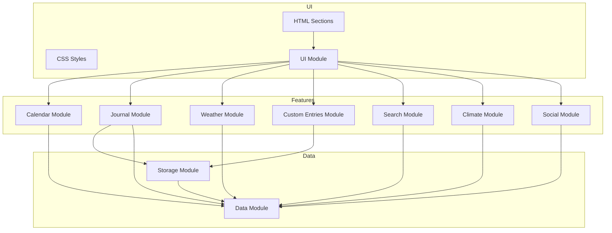

# 🌱 Gardening Calendar App — General Code Review

# 🚩 High-Priority Needs

## 1. Accessibility: Ensure Full Keyboard Navigation
- Test all interactive elements with keyboard only; add/fix tab order and keyboard event handlers as needed.
- **Impact:** Broader usability, legal compliance, improved experience for all users.
- **Status:** 🟡 PARTIALLY COMPLETED - ARIA labels added, but needs keyboard navigation testing.

## 2. Automated Testing (Unit/Integration)
- Add basic unit tests for core modules (e.g., journal logic, storage, export/import).
- **Impact:** Increased reliability, confidence in refactoring, easier onboarding.
- **Status:** 🟡 PARTIALLY COMPLETED - Jest set up, initial unit tests for journal module created.

---

### High-Priority Needs Summary Table

| Priority | Area           | Action/Need                                 | Impact                        | Status        |
|----------|----------------|---------------------------------------------|-------------------------------|---------------|
| High     | Accessibility  | Ensure full keyboard navigation             | Usability, compliance         | 🟡 PARTIAL    |
| High     | Testing        | Add automated tests                         | Reliability, safe refactoring | 🟡 PARTIAL    |

---

## ✅ Completed High-Priority Tasks

1. **Split Large Modules for Maintainability** - `journal.js` has been refactored into smaller modules (`journal-ui.js`, `journal-storage.js`, `journal-logic.js`).
2. **Implement Lazy-Loading for Images** - `loading="lazy"` attribute added to all image elements.
3. **Automated Linting and Formatting** - ESLint and Prettier configured, with npm scripts for linting and formatting.

---

## 1. Project Structure & Modularity
- **Strengths:**
  - Clear separation of concerns: each feature (journal, calendar, weather, etc.) is in its own JS module.
  - Main entry (`main.js`) orchestrates initialization and exposes modules globally for backward compatibility.
  - HTML is well-structured, using semantic elements and clear sectioning.
  - Large modules have been split into smaller, more focused modules (e.g., journal module into UI, storage, logic).
- **Improvement:**
  - Consider using ES module imports/exports everywhere and avoid global `window` assignments for new code.

## 2. Mobile Usability
- **Strengths:**
  - FAB and floating menus are context-aware and only visible in relevant views.
  - Touch targets are large and accessible.
  - Responsive design is handled via CSS and conditional logic.
  - Images now use lazy-loading for better performance on slow connections.
- **Improvement:**
  - Test on a variety of devices for edge cases (e.g., iOS Safari quirks).

## 3. Image Handling
- **Strengths:**
  - All user-uploaded images are compressed (max width: 800px, JPEG quality: 0.7).
  - Thumbnails are generated for galleries.
  - No original, uncompressed images are stored or exported.
  - Lazy-loading is implemented for all images to improve performance.
- **Improvement:**
  - Consider offering user feedback on image compression progress for large files.
  - Optionally, allow users to choose between different compression levels.

## 4. Accessibility
- **Strengths:**
  - All interactive elements have `aria-label` or visible text.
  - Modals are dismissible via Escape and outside click.
  - Visually hidden labels are used for form fields.
- **Improvement:**
  - Ensure all custom controls (e.g., FAB expansion, dropdowns) are keyboard-navigable.
  - Test with screen readers for full accessibility compliance.

## 5. UI/UX Consistency
- **Strengths:**
  - Consistent button styles, colors, and iconography.
  - Floating menus close on outside click or Escape.
  - Only one floating menu can be open at a time.
- **Improvement:**
  - Consider a design system or style guide for future contributors.

## 6. Performance
- **Strengths:**
  - Images are compressed before storage.
  - Large blobs are avoided in localStorage.
  - Lazy-loading now implemented for all images in galleries and timelines.
- **Improvement:**
  - Monitor and optimize bundle size as the app grows.

## 7. Code Quality
- **Strengths:**
  - Modern JS (ES6+) is used throughout.
  - Functions are generally small and focused.
  - Non-obvious logic is commented, especially around image processing and export/import.
  - ESLint and Prettier configured for consistent code style.
- **Improvement:**
  - Consider adding Git pre-commit hooks to run linting and formatting automatically.

## 8. Testing & Debugging
- **Strengths:**
  - Features are tested on both desktop and mobile.
  - Export/import is checked with large journals.
  - Basic testing infrastructure set up with Jest.
- **Improvement:**
  - Expand test coverage beyond the initial journal module tests.
  - Consider a test plan for major features.

## 9. Export/Import
- **Strengths:**
  - Exported JSON is as small as possible (no uncompressed images).
  - User guidance is provided for iOS export/import.
  - Users are warned about potential file size if images are included.
- **Improvement:**
  - Consider supporting cloud export/import (e.g., Google Drive, Dropbox) for users with limited local storage.

## 10. Future-Proofing
- **Strengths:**
  - Mobile-first and offline usability are considered.
  - Data format changes are documented.
- **Improvement:**
  - Consider PWA features for offline access and installability.

---

## 🗺️ High-Level Architecture Diagram (Mermaid)

---

## Summary Table

| Area              | Strengths                                                                 | Suggestions for Improvement                |
|-------------------|--------------------------------------------------------------------------|--------------------------------------------|
| Structure         | Modular, clear separation of concerns, split modules                      | Use ES modules consistently                |
| Mobile Usability  | Responsive, context-aware FAB/menus, lazy-load images                    | Test on more devices                       |
| Image Handling    | Compression, thumbnails, lazy-loading                                    | User feedback on compression, options      |
| Accessibility     | ARIA labels, modal dismiss, hidden labels                                | Keyboard navigation, screen reader tests   |
| UI/UX Consistency | Consistent styles, menu behavior                                         | Consider a design system                   |
| Performance       | Compressed images, lazy-loading, avoids large blobs                      | Monitor bundle size                        |
| Code Quality      | Modern JS, comments, ESLint/Prettier                                     | Add Git pre-commit hooks                   |
| Testing           | Testing infrastructure, manual testing                                   | Expand automated test coverage             |
| Export/Import     | Small JSON, user guidance, file size warnings                            | Cloud export/import                        |
| Future-Proofing   | Mobile-first, offline, changelog                                         | Consider PWA features                      |

---

**Overall:**
Your app is well-structured, modern, and thoughtfully designed for mobile and accessibility. The main improvements would be further automated testing and accessibility polish. Recent enhancements such as module splitting, lazy-loading, and code quality tooling have significantly improved the codebase's maintainability and performance. 