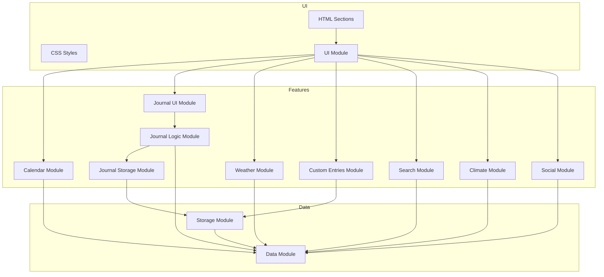

# Gardening Calendar Technical Architecture

This document describes the technical architecture of the Gardening Calendar application, including module structure, development tools, and coding standards.

## Application Architecture

The Gardening Calendar is built as a modular JavaScript application with the following key principles:

* **Module-based structure**: Each feature is contained in its own module
* **Dependency direction**: UI → Logic → Storage (never the reverse)
* **Progressive enhancement**: Core functionality works without JavaScript, enhanced with JS

### High-Level Architecture Diagram

## Module Structure

The application is divided into several key modules:

| Module | Description | Responsibility |
|--------|-------------|----------------|
| `ui.js` | UI utilities | Common UI functions, modals, notifications |
| `data.js` | Data definitions | Constants, translations, default data |
| `storage.js` | Storage adapter | localStorage abstraction, future cloud storage |
| `calendar.js` | Calendar features | Calendar rendering and interactions |
| `journal-ui.js` | Journal UI | DOM rendering, modals, event handlers |
| `journal-logic.js` | Journal logic | Core data manipulation, helper functions |
| `journal-storage.js` | Journal storage | Storage operations for journal entries |
| `weather.js` | Weather features | Weather data fetching and rendering |
| `climate.js` | Climate zone | Köppen climate zone detection and display |
| `search.js` | Search functionality | Search across calendar and journal |
| `custom-entries.js` | Custom entries | User-created plants and tasks |
| `social.js` | Social sharing | Sharing calendar and journal entries |
| `main.js` | Main entry point | Module initialization and orchestration |

## Development Tools

The project uses several development tools to maintain code quality:

### Code Quality

- **ESLint**: JavaScript linting to catch errors and enforce style
- **Prettier**: Code formatting for consistent style

### Testing

- **Jest**: JavaScript testing framework
- **JSDOM**: DOM testing environment for Jest

### Configuration Files

- `.eslintrc.json`: ESLint configuration
- `.prettierrc.json`: Prettier formatting rules
- `package.json`: npm dependencies and scripts
- `.babelrc`: Babel configuration for transpilation

## Development Workflow

### Setting Up Development Environment

1. Clone the repository
2. Install dependencies: `npm install`
3. Run tests: `npm test`
4. Check code quality: `npm run lint`
5. Format code: `npm run format`

### Making Changes

When making changes to the codebase:

1. Follow the established module structure
2. Ensure proper dependency direction (UI → Logic → Storage)
3. Run linting and tests before committing
4. Format code using Prettier

### Testing

The project uses Jest for testing:

- Unit tests for logic functions
- JSDOM for UI component testing
- Run tests with `npm test`

## Deployment

The application is deployed as static HTML/CSS/JS to GitHub Pages.

## Future Improvements

- Complete PWA implementation for offline usage
- Implement cloud storage options
- Add more automated tests for UI components
- Consider bundling for production builds 