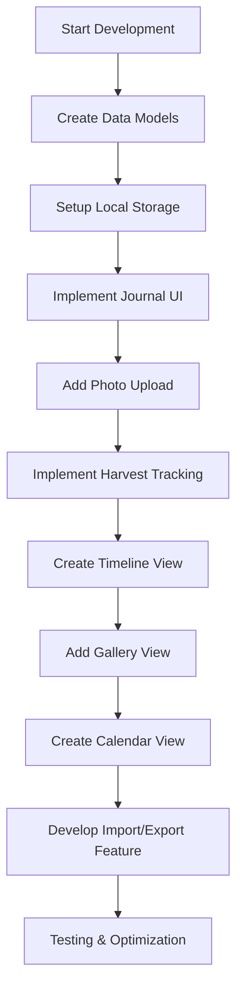
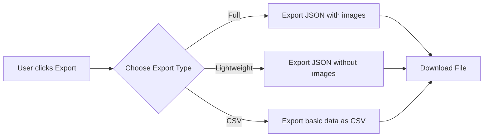
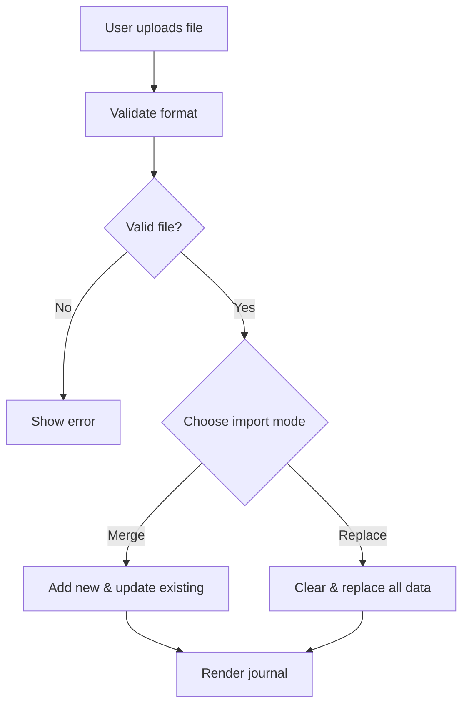

# Garden Journal & Progress Tracking Plan

## Overview

This plan outlines the implementation of a Garden Journal feature for the Spring Gardening and Planting Calendar application. The feature will allow users to record planting activities, document garden progress with photos, and track harvests to improve their gardening practices over time.

## Features

- **Planting Log**: Record what, when, and where plants were established ✅
- **Photo Documentation**: Upload and organize garden photos to track visual progress ✅
- **Harvest Tracking**: Record yields, quality, and notes about harvested produce ✅
- **Progress Analysis**: Visualize gardening activities and results over time ✅
- **Data Portability**: Import and export journal data for backup and sharing ✅

## Implementation Flow



## Implementation Phases

### Phase 1: Core Journal Functionality ✅
- Create data models for journal entries ✅
- Implement local storage for journal data ✅
- Build basic journal UI with entry form ✅
- Add and style journal entry timeline view ✅
- Setup entry editing and deletion ✅

### Phase 2: Media & Organization ✅
- Implement photo upload and compression ✅
- Create photo gallery view ✅
- Add calendar-based organization ✅
- Implement category filtering and search ✅
- Add weather data integration with entries ✅

### Phase 3: Analysis & Optimization ✅
- Create harvest tracking visualizations ✅
- Implement year-to-year comparisons ✅
- Add simple reporting capabilities ✅
- Optimize for mobile devices ✅
- Reduce storage usage with better compression ✅

### Phase 4: Data Portability & Advanced Features ✅
- **Implement import/export functionality** ✅
- **Add data backup and sync capabilities** ✅
- Connect with weather forecast for planting suggestions ✅
- Create plant-specific growth tracking ✅
- Add garden map/layout functionality ✅

## Data Storage

Journal entries will be stored in the browser's localStorage as JSON objects with the following structure:

```json
{
  "id": "unique-entry-id",
  "date": "2025-05-01",
  "type": "planting",
  "plants": ["tomato", "basil"],
  "location": "North garden bed",
  "notes": "Planted 5 tomato seedlings with basil companions",
  "images": ["base64-encoded-image-data"],
  "weather": {
    "temperature": 18,
    "weatherCode": 1,
    "precipitation": 0
  },
  "metrics": {},
  "timestamp": 1714652400000
}
```

## Import/Export Feature Details

### Export Functionality ✅
- Export all journal entries as a single JSON file ✅
- Include base64-encoded images within the JSON structure ✅
- Provide options for:
  - Full export (with images) ✅
  - Lightweight export (without images) ✅
  - CSV export (basic data only, no images) ⏳
- Generate timestamped filenames for exports ✅



### Import Functionality ✅
- Accept uploaded JSON files from previous exports ✅
- Validate file format and data structure ✅
- Provide import modes:
  - Merge (add new entries, update existing by ID) ✅
  - Replace (clear all current entries, use imported data) ✅
- Handle large files with progress indicators ⏳



### Technical Considerations
- **Image Handling**: Base64-encoded images will be included in JSON exports which may create large files ✅
- **Size Optimization**: 
  - Implement further compression before export ✅
  - Offer option to exclude images for smaller file size ✅
- **Browser Limitations**: Warn users about potential performance issues with very large journals ✅
- **Data Validation**: Thoroughly validate imported data to prevent corruption ✅

## UI Components

- Journal entry form with image upload ✅
- Timeline view for chronological browsing ✅
- Gallery view for photo-centric browsing ✅
- Calendar view for date-based organization ✅
- Import/Export controls in journal header ✅
- Responsive design for mobile and desktop ✅

## Success Metrics

- User adoption of journal feature 
- Number of entries created
- Photos uploaded per entry
- Frequency of journal use
- Successful import/export operations

## Current Status (Last Updated: July 8, 2024)

We have completed all major functionality for the Garden Journal feature:

- ✅ All core journal functionality (Phase 1)
- ✅ Media & organization features (Phase 2)
- ✅ Analysis & optimization features (Phase 3)
- ✅ Data portability & advanced features (Phase 4)

Recent improvements:
- Enhanced the import/export functionality with improved UX
- Replaced basic browser confirmation dialogs with custom modals 
- Added modern modal interfaces for export options and import choices
- Implemented better user interaction with close buttons, escape key functionality, and click-outside closing

Pending items:
- ⏳ CSV export format (lower priority)
- ⏳ Progress indicators for large file imports

Overall, the Garden Journal feature is complete and ready for user testing. The enhanced UI for import/export functionality provides a much better user experience than the basic browser dialogs, aligning with the modern look and feel of the rest of the application. 