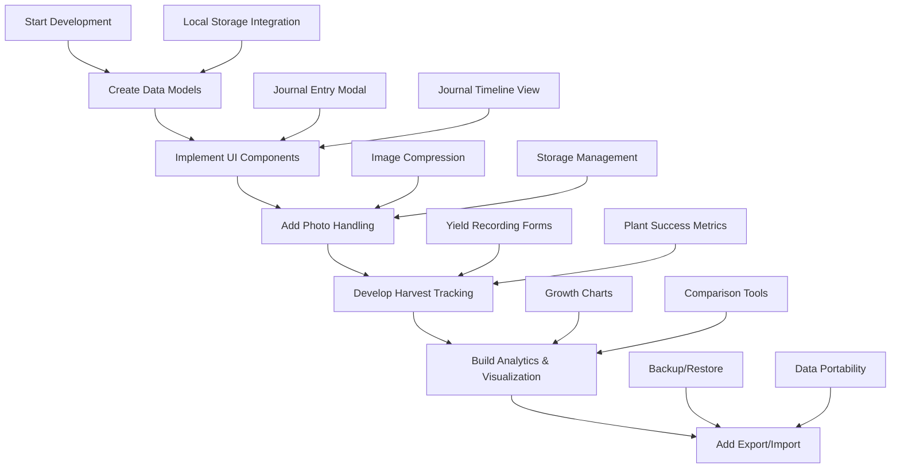
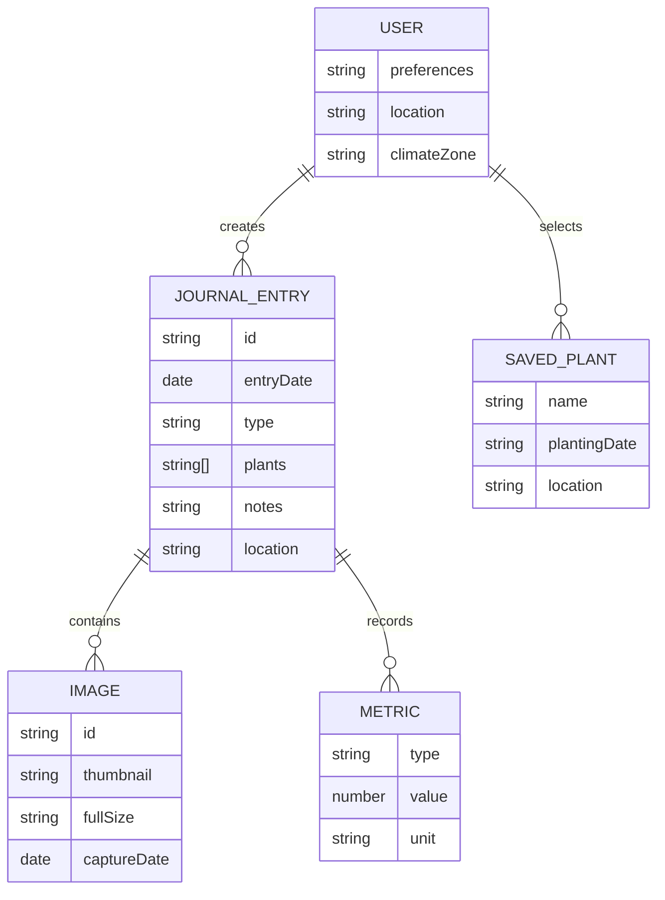
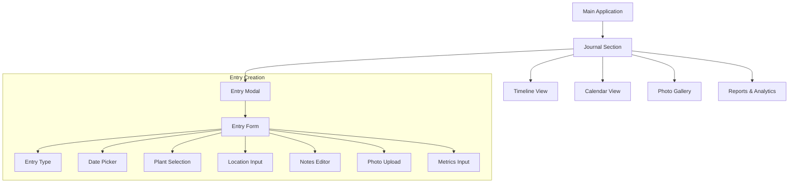
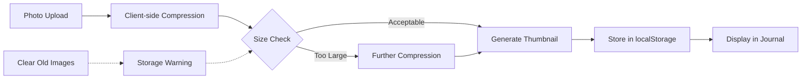
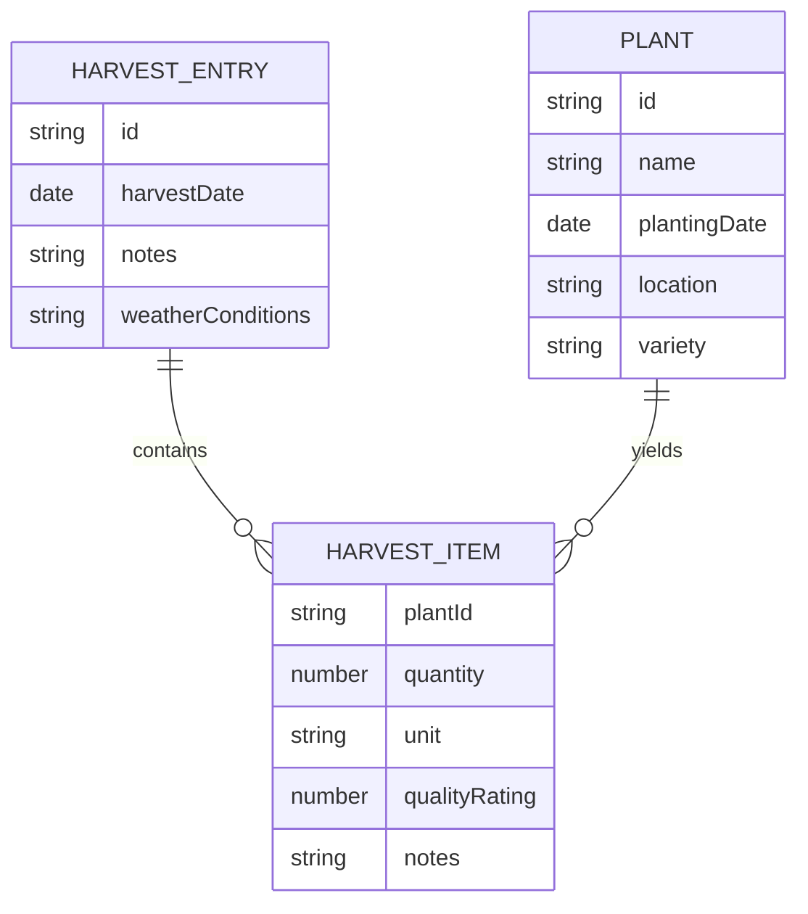
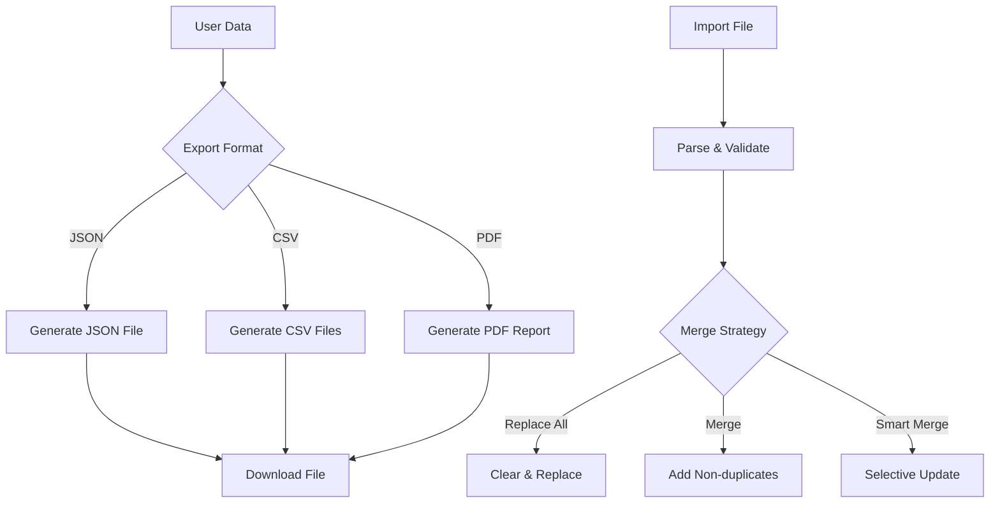

# Garden Journal & Progress Tracking Plan

## Overview

This plan outlines the implementation of a Garden Journal feature for the Spring Gardening and Planting Calendar application. The feature will allow users to record planting activities, document garden progress with photos, and track harvests to improve their gardening practices over time.

## Features

- **Planting Log**: Record what, when, and where plants were established
- **Photo Documentation**: Upload and organize garden photos to track visual progress
- **Harvest Tracking**: Record yields, quality, and notes about harvested produce
- **Progress Analysis**: Visualize gardening activities and results over time

## Implementation Flow



## Phase 1: Data Model & Local Storage

### Journal Entry Data Structure

```javascript
{
  id: "unique-id-timestamp", 
  date: "2025-05-01",
  type: "planting|care|harvest",
  plants: ["tomato", "basil"],
  notes: "Text description",
  location: "north bed",
  metrics: {
    quantity: 5,
    containers: 2,
    area: "1 sq ft"
  },
  images: ["data:image/jpeg;base64,..."] // Base64 encoded or file references
}
```

### Storage Architecture



### Local Storage Implementation

- Store all journal entries in localStorage
- Implement size monitoring to prevent exceeding 5MB limits
- Create indexing system for quick filtering and searching

## Phase 2: UI Components

### Interface Architecture



### Key UI Components

1. **Journal Button**: Add to main navigation
2. **Journal Entry Modal**: Form for creating/editing entries
3. **Timeline View**: Chronological display of journal entries
4. **Calendar View**: Month view showing entry distribution
5. **Photo Gallery**: Grid view of uploaded photos
6. **Search & Filter**: Tools to find specific entries

### Mobile Responsive Design

- Optimize photo upload for mobile devices
- Ensure touch-friendly interface for field data entry
- Implement swipe navigation for timeline browsing

## Phase 3: Photo Management

### Photo Handling Process



### Technical Implementation

- Use HTML5 FileReader API for client-side image handling
- Implement canvas-based image compression
- Create thumbnail generation for gallery views
- Store images as Base64 strings with size optimizations

## Phase 4: Harvest Tracking

### Harvest Data Model



### Yield Visualization

- Create charts showing harvest quantities over time
- Compare yields between different plant varieties
- Track success rate for different planting methods

## Phase 5: Data Management

### Export/Import Functionality



### Backup Solutions

- Implement periodic auto-backup to localStorage
- Provide one-click backup download
- Add reminder system for regular backups

## Technical Challenges & Solutions

### Storage Limitations

- **Challenge**: localStorage 5MB limit
- **Solutions**:
  - Aggressive image compression
  - Thumbnail-only storage with optional full images
  - Periodic export recommendations
  - Oldest-first cleanup suggestions

### Performance Optimization

- Use virtual scrolling for large journal lists
- Implement lazy loading for images
- Create indexed search for faster filtering

### Browser Compatibility

- Test across major browsers
- Provide fallbacks for older browsers
- Use feature detection for advanced capabilities

## Development Approach

1. Create feature branch: `git checkout -b garden-journal-feature`
2. Implement core journal functionality without images
3. Add basic photo capabilities with size management
4. Implement harvest tracking features
5. Add export/import and data management
6. Optimize performance and storage usage

## Success Metrics

- Journal entries can be created, viewed and edited
- Photos can be uploaded and displayed with acceptable quality
- Harvest data can be recorded and analyzed
- Data can be exported and imported reliably
- Application performance remains fast with substantial journal data 